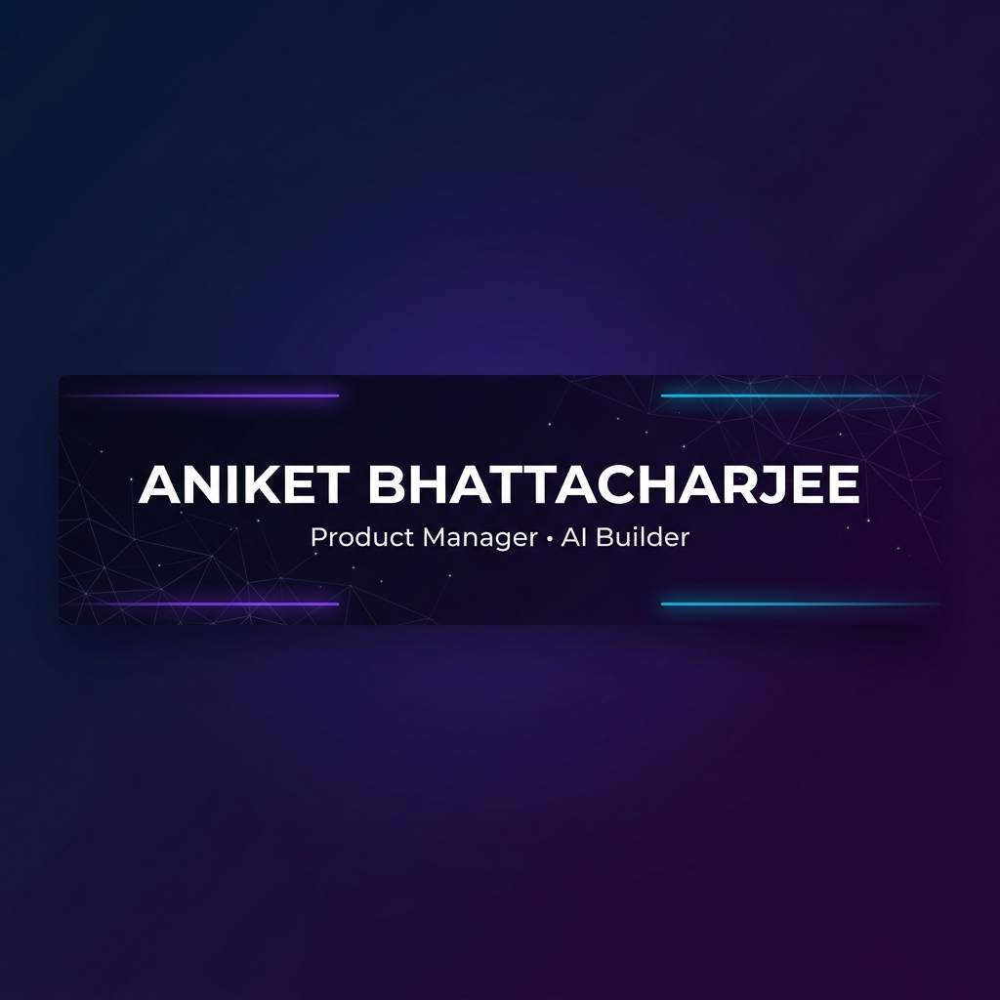

<p align="center">
  
</p>

<p align="center">
  <a href="https://aniisokay-website.vercel.app/" target="_blank"></a>
  <a href="mailto:iamaniket76@gmail.com" target="_blank"></a>
  <a href="https://github.com/ani212" target="_blank"></a>
</p>

<br/>

<p align="center">
  
</p>

<br/>

<!-- ━━━━━━━━━━━━━━━━━━━━ ABOUT ━━━━━━━━━━━━━━━━━━━━ -->


<br/>

<h2>🧠 &nbsp;About Me</h2>

```yaml
name: Aniket Bhattacharjee
role: Product Manager & AI Builder
location: Mumbai, India
focus:
  - AI-Powered Product Development
  - Customer Discovery & Research
  - Competitive Intelligence
  - Workflow Automation
motto: "Ship products, not demos."
```

<br/>

<!-- ━━━━━━━━━━━━━━━━━━━━ PROJECTS ━━━━━━━━━━━━━━━━━━━━ -->


<br/>

<h2>🚀 &nbsp;Featured AI Products</h2>

<table>
<tr>
<td width="50%" valign="top">

<h3 align="center">🔍 ProductLens AI</h3>
<p align="center">
  <a href="https://product-lens-ai-red.vercel.app/" target="_blank">
    
  </a>
  <a href="https://github.com/ani212/ProductLens-AI" target="_blank">
    
  </a>
</p>
<p align="center"><strong>AI-Powered Competitive Intelligence</strong></p>
<p align="center">
  <sub>Generate comprehensive product teardowns from just a name. SWOT analysis, feature gaps, competitor comparison, and evidence-backed recommendations.</sub>
</p>
<p align="center">
  
  
  
  
</p>

</td>
<td width="50%" valign="top">

<h3 align="center">💡 Discovery AI</h3>
<p align="center">
  <a href="https://discovery-os-pi.vercel.app/" target="_blank">
    
  </a>
  <a href="https://github.com/ani212/DiscoveryOS" target="_blank">
    
  </a>
</p>
<p align="center"><strong>AI-Powered Customer Discovery</strong></p>
<p align="center">
  <sub>Transform interviews, surveys, reviews, and support chats into structured product insights. Theme detection, sentiment analysis, and opportunity mapping.</sub>
</p>
<p align="center">
  
  
  
  
</p>

</td>
</tr>
<tr>
<td width="50%" valign="top">

<h3 align="center">🔥 Resume Roaster</h3>
<p align="center">
  <a href="https://resume-roaster-silk.vercel.app/" target="_blank">
    
  </a>
  <a href="https://github.com/ani212/Resume-Roaster" target="_blank">
    
  </a>
</p>
<p align="center"><strong>AI Resume Review & ATS Optimization</strong></p>
<p align="center">
  <sub>Upload a resume, get honest feedback — ATS compatibility score, missing keywords, rewritten bullet points, and a personalized improvement roadmap.</sub>
</p>
<p align="center">
  
  
  
</p>

</td>
<td width="50%" valign="top">

<h3 align="center">🍳 Raw — Resume Hell's Kitchen</h3>
<p align="center">
  <a href="https://raw-olive.vercel.app/" target="_blank">
    
  </a>
  <a href="https://github.com/ani212/Raw" target="_blank">
    
  </a>
</p>
<p align="center"><strong>Gordon Ramsay-Style Resume Roasting</strong></p>
<p align="center">
  <sub>Brutally honest, entertainingly savage resume feedback that actually helps you improve. Upload your resume and brace for impact.</sub>
</p>
<p align="center">
  
  
  
</p>

</td>
</tr>
</table>

<br/>

<!-- ━━━━━━━━━━━━━━━━━━━━ MISSION ━━━━━━━━━━━━━━━━━━━━ -->


<br/>

<h2>🎯 &nbsp;The Mission</h2>

<table>
<tr>
<td align="center" width="33%">
  <br/>
  
  <br/><br/>
  <strong>What are users saying?</strong>
  <br/>
  <sub>Discovery AI</sub>
  <br/><br/>
</td>
<td align="center" width="33%">
  <br/>
  
  <br/><br/>
  <strong>What are competitors doing?</strong>
  <br/>
  <sub>ProductLens AI</sub>
  <br/><br/>
</td>
<td align="center" width="33%">
  <br/>
  
  <br/><br/>
  <strong>How do I stand out?</strong>
  <br/>
  <sub>Resume Roaster</sub>
  <br/><br/>
</td>
</tr>
</table>

<p align="center">
  <sub><em>Building an ecosystem of AI products that transforms unstructured information into clear, evidence-backed decisions.</em></sub>
</p>

<br/>

<!-- ━━━━━━━━━━━━━━━━━━━━ TECH STACK ━━━━━━━━━━━━━━━━━━━━ -->


<br/>

<h2>🛠️ &nbsp;Tech Stack</h2>

<p align="center">
  
</p>

<p align="center">
  
  
  
  
  
  
</p>

<br/>

<!-- ━━━━━━━━━━━━━━━━━━━━ FOOTER ━━━━━━━━━━━━━━━━━━━━ -->


<br/>

<p align="center">
  
</p>

<p align="center">
  <a href="https://aniisokay-website.vercel.app/" target="_blank"></a>&nbsp;
  <a href="mailto:iamaniket76@gmail.com" target="_blank"></a>&nbsp;
  <a href="https://github.com/ani212" target="_blank"></a>
</p>

<p align="center">
  
</p>
